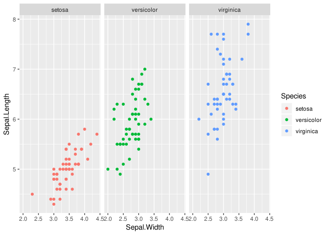

Preamble
========

The goal of this lab is help prepare you for the mid-term. To that end,
it will focus on the types of tasks you will be asked to perform in
order to ace the mid-term. This lab may take longer than others we have
done, but I hope you will find it useful.

Before we begin, I do want to apologize for cancelling this week’s
class. It was, unfortunately, the best decision I could make. As of
Friday afternoon, I am still fighting an intermittent fever. This year’s
flu is a nasty beast. Please take care of yourselves.

Topics which will be tested directly:

-   Data Import:
    <a href="https://r4ds.had.co.nz/data-import.html" class="uri">https://r4ds.had.co.nz/data-import.html</a>
    -   CSV: `read_csv()`
    -   Excel: `read_excel()`
-   Data Graphing (ggplot):
    <a href="https://r4ds.had.co.nz/data-visualisation.html" class="uri">https://r4ds.had.co.nz/data-visualisation.html</a>
    -   Scatter plots: `geom_point()`
    -   Boxplot: `geom_boxplot()`
    -   Barplot: `geom_bar()`
    -   Column: `geom_col()`
    -   Using color and facets to compare groups.
-   Exploratory Data Analysis:
    <a href="https://r4ds.had.co.nz/exploratory-data-analysis.html" class="uri">https://r4ds.had.co.nz/exploratory-data-analysis.html</a>
-   Single Table data manipulation:
    <a href="https://r4ds.had.co.nz/transform.html" class="uri">https://r4ds.had.co.nz/transform.html</a>
    -   Filtering data: `filter()`
    -   Ordering data: `arrange()`
    -   Select columns: `select()`
    -   Creating new columns: `mutate()`
    -   Summary/Aggregate calculations: `summarize()`
    -   Grouping: `group_by()`

Other topics, such as creating a project, writing a script, etc. will be
implicitly part of the mid-term.

This year’s mid-term will not include relational data. We will discuss
relational data further during our next class, but I do not feel it is
fair to include this topic on the mid-term this year. But it will be
part of the final exam.

Tidyverse
---------

What the heck is the tidyverse? The tidyver verse is a R meta-package. A
meta-package is a collection of packages.

[Welcome To the
Tidyverse](https://blog.revolutionanalytics.com/2016/09/tidyverse.html)

So what is a package? Well, that’s a little hard to answer. A formal
answer can be taken from Hadley Wickham, who wrote most of the tidyverse
packages:

> In R, the fundamental unit of shareable code is the package. A package
> bundles together code, data, documentation, and tests, and is easy to
> share with others. As of January 2015, there were over 6,000 packages
> available on the Comprehensive R Archive Network, or CRAN, the public
> clearing house for R packages. This huge variety of packages is one of
> the reasons that R is so successful: the chances are that someone has
> already solved a problem that you’re working on, and you can benefit
> from their work by downloading their package.

– [R packages](http://r-pkgs.had.co.nz/intro.html)

To see a list of currently available packages for R, you can peruse
[Available CRAN Packages By
Name](https://cran.r-project.org/web/packages/available_packages_by_name.html)

The best analogy I have ever come up with, is to compare R packages to
the Apple App Store or Google Play store for your cell phone. [Base
R](https://rstudio.com/wp-content/uploads/2016/05/base-r.pdf) comes with
a huge number of general purpose functions which are useful for
statistical programming. For example, Base R includes a set of data
types useful for programming, common statistical functions such as
`mean` for calculating aggregate statistics, and includes functions for
linear and logistic regression modeling (among many other things).
Similarly, your phone, comes equipped with a browser, email, phone app,
calendar app, etc. These are core applications a cell-phone needs in
order to be minimally useful. Can you imagine paying money for a phone
that didn’t include a web browser (Chome or Safari) by default?

I can’t, at least not today. I do remember my Dad’s first
[bag-phone](https://en.wikipedia.org/wiki/Motorola_Bag_Phone), but that
was in the early 90’s. Things are a little different today. That said, I
assume you have one or more applicatins installed on your phone beyond
the apps it came with pre-installed. You may have installed a
video-game, or chat app. Or perhaps you are an Instagrammer, or maybe
you just use Canvas on your phone. When your phone needs additional
functionality, you install an application to make it easier for your
phone to do something.

You *could* Instagram tonight’s Ramen noodles using Safari, but it is
easier to install the Instagram app. Or, at least, that’s what the
Millenials tell me. :-)

R packages serve a similar role. The tidyverse is a set of functions
which make programming in R more convenient. We *could* use Base R for
this course. None of you would like it very much and I would have to
teach you a bunch of more complex programming techniques, but we *could*
do it. Just like you *can* Instagram with Safari. But it is easier to
install they tidyverse and program in a more modern style of R-code. The
tidyverse is, itself, composed of a number of smaller packages such as:

-   [ggplot](https://ggplot2.tidyverse.org/reference/)
-   [dplyr](https://dplyr.tidyverse.org/reference/)
-   etc.

Note: Those last two links are really useful. They are links to the
official documentation for dplyr (data transformations) and ggplot
(plotting). Did I mention the mid-term is open-book, open-notes? Can I
be any more obvious? Does your browser come with bookmarks?

Functional Composition
----------------------

Before we begin, a word on functional composition. A computer program is
nothing more than a list of instructions. These instructions, called
functions, allow us to embed complex logic into the program. Because
statistics and data analysis are fundamentally complex things, these
programs tend to be complicated. Some programming languages, such as SAS
and SPSS have a relatively small number of core functions, which have a
large number of parameters, sub-commands, and features. For example, the
SAS DATA step. Other programming languages such as R and Python have
many more commands, which each do one little thing. Either approach
allows the programmer to create very complex programs, but how they do
so differs.

In a programming language such as R, we must string together a series of
related commands to accomplish complex tasks such as plotting, data
transformation, etc. The art of assembling many small commands together
to act as a cohesive unit is called Functional Composition. We will
encounter three forms of functional composition in our class.

1.  GGPLot: `+`
2.  dplyer: `%>%`
3.  Nested functions: `foo(baz(0))`

Each is useful. But it is important for you to understand they are all
fundamentally doing the same thing, which is passing the results from
one function to another function. This way, you the user, can create
code blocks of arbitrary complexity, depending on your needs and
programming skillm, which should grow over time.

Take, for example, ggplot, which is loaded when you load the tidyverse.
Each plot made with ggplot is actually a composition of several
functions. For example, a scatter-plot showing the relationship between
sepal width and length in the
[iris](https://en.wikipedia.org/wiki/Iris_(plant)) looks like this:

``` r
data(iris)

ggplot(data = iris, mapping = aes(x = Sepal.Width, y = Sepal.Length, color = Species)) +
    geom_point() +
    facet_wrap(~Species)
```



Now that you’ve done this a few times, I want to re-visit what all of
this code is ACTUALLY doing. We will ignore `data(iris)` in the analysis
below. It is not part of our ggplot composition. That command, just
loads the data. The rest of the code has quite a lot going on. To
produce that single plot, we needed three commands:

<table>
<colgroup>
<col style="width: 27%" />
<col style="width: 25%" />
<col style="width: 47%" />
</colgroup>
<thead>
<tr class="header">
<th style="text-align: left;">Command</th>
<th style="text-align: left;">Description</th>
<th style="text-align: center;">Compositional Operator</th>
</tr>
</thead>
<tbody>
<tr class="odd">
<td style="text-align: left;">ggplot()</td>
<td style="text-align: left;">Identifies the data source, assigns values to the X and Y axis, and color.</td>
<td style="text-align: center;"><code>+</code></td>
</tr>
<tr class="even">
<td style="text-align: left;">geom_point()</td>
<td style="text-align: left;">Tells ggplot to create a scatter plot.</td>
<td style="text-align: center;"><code>+</code></td>
</tr>
<tr class="odd">
<td style="text-align: left;">facet_wrap()</td>
<td style="text-align: left;">Stratifies the plot into three plots, one for each species.</td>
<td style="text-align: center;"><code>+</code></td>
</tr>
</tbody>
</table>

Lab 06
======

Setup
-----

1.  Use RStudio to create a new project called Week 06. ([RStudio
    Projects](https://r4ds.had.co.nz/workflow-projects.html#rstudio-projects))
2.  We will use two data sets for this week’s lab:
    -   [births.csv](https://github.com/intro-to-data/Data/blob/master/births.csv)
        (which you have seen before)
    -   [MedicaidNewbornLowBirthWeightByCounty.csv](https://github.com/intro-to-data/Data/blob/master/MedicaidNewbornLowBirthWeightByCounty.csv)
        (which you have not seen before)
3.  To keep things relatively simple, we will open the data directly
    through R. Create a file called `Lab 06.R` and copy/paste the
    following:

``` r
## INIT ========================================================================
library(tidyverse)


## VARS ========================================================================
births_url <- "https://github.com/intro-to-data/Data/raw/master/births.csv"
lbw_url <- "https://github.com/intro-to-data/Data/raw/master/MedicaidNewbornLowBirthWeightByCounty.csv"


## DATA ========================================================================
CountyLBW <- read_csv(lbw_url)
```

    ## Parsed with column specification:
    ## cols(
    ##   Year = col_double(),
    ##   County = col_character(),
    ##   Burrough = col_character(),
    ##   Region = col_character(),
    ##   Upstate = col_logical(),
    ##   LowBirthWeightNewborns = col_double(),
    ##   NewbornPopulation = col_double()
    ## )

``` r
CountyLBW$Year <- factor(CountyLBW$Year)

## How can we import the births data into a tibble called AlbanyBirths?
## Your Code Here!
```

1.  The code provided in Step 03 is incomplete. It creates a tibble
    called LBW, which contains our Low Birth Weight data. It does not
    create a tibble called AlbanyBirths, which you will later need. Your
    task is to create Albany Births.

Low Birth Weight
----------------

Low Birth Weight (LBW) ([Low Birth Weight -
Wikipedia](https://en.wikipedia.org/wiki/Low_birth_weight)) is defined
by World Health Organization as a birth weight of 2,499 grams (5.51 lbs)
or less, regardless of gestational age. Simplistically, LBW is caused by
one of two factors (or a combination of the two).

1.  Preterm birth: birth prior to 37 weeks of gestational age
2.  Small for gestational age: below average prenatal growth

Of course, the causes for these two conditions are many. As we will see
later in this lab, LBW babies tend to cost more than other babies.

The CountyLBW dataset you have opened is a modified version of the
Health Data New York [Medicaid Newborn Low Birth Weight Rates by
County](https://health.data.ny.gov/Health/Medicaid-Inpatient-Prevention-Quality-Indicator-PQ/aapx-etcg).
It contains data for CY 2012 and 2013. Unfortunately, more recent data
is not available. It contains the following columns:

-   `Year`: The year of the hospital discharge for the newborn. (either
    2012 or 2013)
-   `County`: The newborn’s county of residence at time of discharge.
    Hospital discharges that did not have an accurate New York State
    county were excluded.
-   `Burrough`: The newborn’s burrough or residence. Only relevant for
    children born in New York City. For all other newborns, this columns
    is `NA`.
-   `Region`: The newborn’s region of residence. [Regions of New York
    (state) -
    Wikipedia](https://en.wikipedia.org/wiki/Category:Regions_of_New_York_(state))
-   `Upstate`: The newborn was born in Upstate New York (TRUE) or not
    (FALSE)
-   `LowBirthWeightNewborns`: Total number of Medicaid low birth weight
    newborn discharges in a county population that meet the criteria for
    low birth weight.
-   `NewbornPopulation`: Total number of newborn Medicaid enrollees in a
    county population.

It is very important for you to remember that the grain of the CountyLBW
data set is Medicaid Births *per County*. However, the data contains
enough information for us to create new data sets at more aggregated
grains. For example, we will examine the Births per Region, but we
cannot examine births per zip code.

### Tasks

1.  Create a scatter plot of Medicaid new born populations. From 2012 to
    2013, did the number of births go up or down? To help you, try
    adding `group = County` to your aesthetic mapping (`aes()`) and
    after your `geom_point()`, add a `geom_line()`.

2.  Create a statewide summary of Medicaid births in New York for 2012
    and 2013. To

How would you describe the trend, by county?

-   Increasing births.
-   Decreasing births.
-   Some increasing, some descreasing.
-   Really hard to say.

Enter your answer into canvas.
